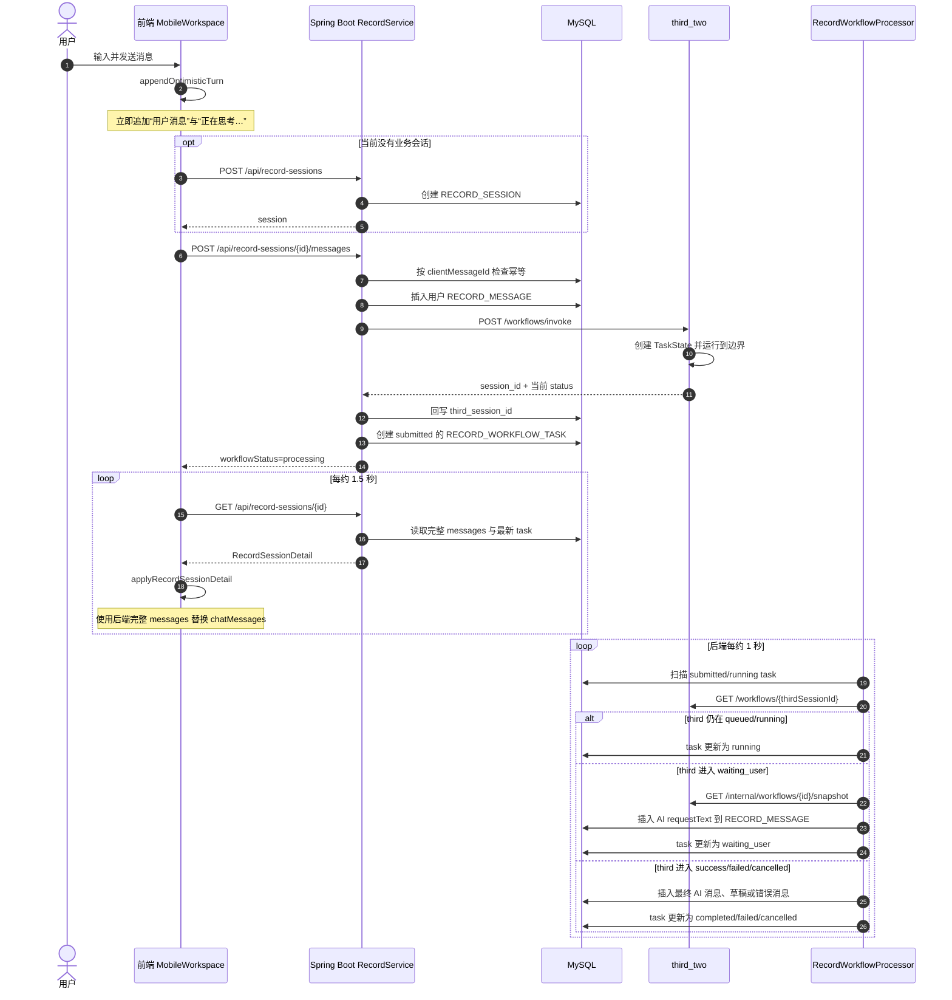
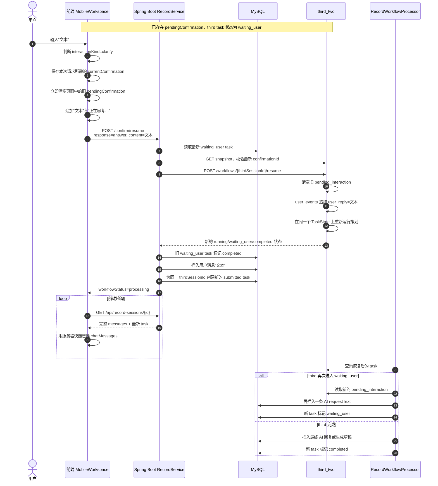

# 记录对话消息传递流程（当前实现）

本文记录 2026-07-18 本地代码中的真实消息链路，范围包括：

- 前端发送普通消息、展示“正在思考”和轮询会话；
- Spring Boot 保存消息、跟踪异步 workflow；
- `third_two` 创建任务、追问、恢复任务和生成最终回复；
- 追问文本、确认状态与数据库消息如何重新进入前端；
- 上一条追问曾被重复显示的原因与当前修复方式。

本文描述的是当前实现；“提交回答后又显示上一条追问”的前端问题已于 2026-07-18 修复。

## 1. 参与模块与各自职责

| 模块                        | 当前职责                                                                            |
| --------------------------- | ----------------------------------------------------------------------------------- |
| `ChatScreen`              | 渲染`chatMessages`、`pendingConfirmation`、草稿和底部输入框。                   |
| `MobileWorkspace`         | 管理乐观消息、“正在思考”、接口调用、轮询和会话状态替换。                          |
| `RecordSessionController` | 提供记录会话、消息发送、追问恢复和确认接口。                                        |
| `RecordService`           | 保存业务消息、调用`third_two`、创建 workflow 跟踪任务、把 third 状态落到业务库。  |
| `BusinessRepository`      | 读写`RECORD_MESSAGE`、`RECORD_WORKFLOW_TASK`、草稿和正式记录。                  |
| `RecordWorkflowProcessor` | 每秒扫描一次`submitted/running` 任务并推进本地状态。                              |
| `ThirdWorkflowClient`     | 调用`third_two` 的 invoke、get、resume 和 snapshot 接口。                         |
| `third_two`               | 保存同一 AI task 的`TaskState`，滚动规划下一步动作，必要时进入 `waiting_user`。 |

## 2. 三类状态不是同一个数据源

当前聊天页同时组合了三类数据：

| 数据             | 权威来源                                                                             | 是否持久化   | 前端用途                             |
| ---------------- | ------------------------------------------------------------------------------------ | ------------ | ------------------------------------ |
| 用户/AI 历史消息 | MySQL`RECORD_MESSAGE`                                                              | 是           | 按`sequence_no` 渲染历史气泡。     |
| “正在思考…”   | 前端本地状态，或`latestWorkflowTask=submitted/running`                             | 否           | 表示当前 workflow 仍在处理。         |
| 当前追问/确认    | `third_two TaskState.pending_interaction`，经 backend 转成 `pendingConfirmation` | third 内保存 | 决定输入框语义以及是否显示确认按钮。 |

因此，`pendingConfirmation.requestText` 与 `RECORD_MESSAGE` 中的 AI 消息可能包含同一段文字。当前前端在提交交互回答时会立即移除旧 `pendingConfirmation`；渲染层还会识别“历史中已有相同 AI 追问，且其后存在本地 pending 消息”的过渡状态，避免把旧追问再次当成新回复渲染。

## 3. 普通消息发送流程



### 前端轮询时的替换规则

`applyRecordSessionDetail(detail)` 会执行以下操作：

1. 根据会话终态计算 `session`、`draft`、`pendingConfirmation`；
2. 调用 `conversationMessagesFromDetail(detail)`；
3. 将后端返回的完整 `messages` 直接设置为新的 `chatMessages`；
4. 如果最新任务仍为 `submitted/running`，在消息末尾临时添加“正在思考…”。

这不是按单条消息增量追加，而是每次轮询都以服务器完整快照覆盖当前对话。

## 4. 回答 AI 追问的流程

截图中的“文本”走的是追问恢复流程，不是新的 `/messages` 请求。



### `third_two` 如何接收“文本”

`third_two` 不会创建新的 AI task，而是在原 TaskState 中：

1. 校验 `interaction_id`；
2. 删除旧 `pending_interaction`；
3. 向 `user_events` 添加：

```json
{
  "event_type": "user_reply",
  "content": "文本"
}
```

4. 将 TaskState 改回 `running`；
5. 把 `original_input`、最近 `user_events`、已知槽位、上次动作和 Artifact 再交给 planner；
6. planner 选择下一动作，可能完成任务，也可能再次选择 `ask_user`。

当前没有确定性代码把“文本”直接写成“抽象程度字段的 field_type”。是否正确吸收这条回答，主要依赖 planner 从 `user_events` 推断并通过下一次决策或 `state_patch.known_slots` 表达。

## 5. 写操作确认流程

当 `pendingConfirmation.interactionKind=confirm` 时，前端显示“确认执行/暂不执行”按钮：

- `approve`：继续同一个 third task，执行已经准备好的写动作；
- `modify`：用户在输入框里说明修改内容，third 回到 planner 重新规划；
- `cancel`：third task 取消，backend 关闭当前交互，必要时恢复草稿；
- 写操作成功后，backend 根据是否存在本地草稿决定是否创建 `DAILY_RECORD`。

确认、追问和候选选择共用 `/confirm/resume`，但通过 `response=approve|modify|answer|cancel` 区分语义。

## 6. 截图中重复内容的原因与修复

修复前截图中的顺序是：

1. 已持久化的上一条 AI 追问；
2. 用户本轮回答“文本”；
3. 前端临时“正在思考…”；
4. 前端根据尚未清空的旧 `pendingConfirmation.requestText`，临时又渲染了一次上一条追问。

### 6.1 直接原因：前端重复渲染旧 pendingConfirmation

`resolvePendingConfirmation()` 在发送回答时先执行：

```text
chatMessages = 历史消息 + 用户“文本” + “正在思考…”
```

修复前要等 `/confirm/resume` 返回 `workflowStatus=processing` 后才执行 `setPendingConfirmation(null)`。在请求等待期间，`ChatScreen` 仍能读到旧追问：

```text
interactionPrompt = pendingConfirmation.requestText
```

随后 `ChatScreen` 只判断：

```text
messages[messages.length - 1].content === interactionPrompt
```

此时最后一条消息是“正在思考…”，不是历史中的旧追问，所以页面又渲染一条 `interactionPrompt`。这正好形成截图中的顺序。

### 6.2 当前修复

修复包含两层：

1. `resolvePendingConfirmation()` 先把当前交互保存到局部变量 `currentConfirmation`，然后在追加用户回答和“正在思考…”之前立即执行 `setPendingConfirmation(null)`。请求仍使用已保存的交互 ID，不会丢失恢复任务所需的信息。
2. `ChatScreen` 通过 `shouldShowInteractionPrompt()` 判断交互提示是否需要单独展示。若相同 AI 提示已经出现在历史消息中，且其后存在本地 pending 消息，则不会再次渲染这段旧提示。

如果请求失败，`recoverChatAction()` 会重新读取服务器会话快照；真实的最新 `pendingConfirmation`、历史消息和 workflow 状态会从服务器恢复，不依赖已经清除的旧页面状态。

### 6.3 本地数据库证据

对截图对应本地会话进行只读查询后，`RECORD_MESSAGE` 的实际顺序是：

| sequence_no | sender | 内容摘要                               |
| ----------- | ------ | -------------------------------------- |
| 1           | user   | 新增一个抽象程度字段                   |
| 2           | ai     | 询问“抽象程度”的字段类型和属性       |
| 3           | user   | 文本                                   |
| 4           | ai     | 已识别为文本，继续询问是否需要其他属性 |
| 5           | user   | 不需要                                 |
| 6           | ai     | 确认执行修改飞书字段                   |
| 7           | ai     | 字段创建成功                           |

原问题在数据库中只有 sequence 2 一条。sequence 4 是不同的新问题，说明截图末尾那条相同文字并不是 backend 再次落库，也不是 third 在这一轮重新问了同一句，而是前端请求期间的派生展示。

### 6.4 third 仍需保留的语义防线

`third_two` 恢复后会把“文本”放入 `user_events`，但没有确定性字段槽位合并。若 planner 将来没有把短回答解释成字段类型，仍可能再次生成相同的 `ask_user`。

这类情况属于“任务语义没有吸收用户回答”，与本次前端临时重复是不同问题，不能用隐藏气泡代替语义修复。

### 6.5 backend 仍需保留的幂等防线

`RecordService.applyWaitingUserTask()` 在每次新 task 进入 `waiting_user` 时都会执行：

```text
insertMessage(sessionId, "ai", requestText, ...)
```

当前 `RECORD_MESSAGE` DTO 不包含 `confirmationId`，数据库写入前也没有按“thirdSessionId + confirmationId”检查这条交互消息是否已经存在。因此 backend 不能区分：

- 同一个交互被重复处理；
- 新交互恰好用了相同文案；
- planner 确实重新问了一次同样的问题。

虽然本次数据库没有重复记录，这里仍是以后避免并发处理或重复消费时需要检查的幂等点。

### 6.6 前端以服务器消息快照替换本地消息

前端轮询后会使用数据库中的完整消息列表覆盖本地消息。旧问题作为历史消息会保留，这是当前设计。

当前实现已经处理“历史追问 + 新用户回答 + 正在思考 + 旧 pendingConfirmation”这一过渡状态。旧追问仍作为历史保留；新的真实回复到达后，服务器完整消息快照会覆盖本地“正在思考…”。

仍需保持的边界是：

1. 前端只处理展示去重，不隐藏 third 真正产生的新交互；
2. third 应正确吸收回答，不无意义地重问；
3. backend 后续可按交互身份增强幂等落库；
4. 前端继续以服务器快照为权威，但不承担 third 的语义去重。

## 7. 当前关键标识

| 标识                        | 生成位置         | 用途                                             |
| --------------------------- | ---------------- | ------------------------------------------------ |
| `turnId`                  | 前端             | 标记本地乐观用户消息和“正在思考…”，不传后端。 |
| `clientMessageId`         | 前端             | 普通`/messages` 请求幂等。                     |
| `RECORD_MESSAGE.id`       | backend          | 持久化消息主键。                                 |
| `sequenceNo`              | backend          | 确定会话历史消息顺序。                           |
| `thirdSessionId`          | third_two        | 标识持续滚动的同一个 AI TaskState。              |
| `confirmationId`          | third_two        | 标识某一次具体追问或确认。                       |
| `RECORD_WORKFLOW_TASK.id` | backend          | 跟踪一次提交、恢复或确认后的异步处理。           |
| `clientActionId`          | backend          | 保证同类 workflow task 创建幂等。                |
| `requestId`               | backend 请求链路 | 日志、消息和任务追踪。                           |

## 8. 源码入口

- 前端发送、轮询与状态替换：`frontend/src/app/MobileWorkspace.tsx`
- 前端消息快照转换：`frontend/src/app/chatConversation.ts`
- 前端消息渲染：`frontend/src/pages/ChatScreen.tsx`
- 前端记录接口：`frontend/src/features/record/api.ts`
- backend HTTP 接口：`backend/src/main/java/com/formygirl/record/session/RecordSessionController.java`
- backend 消息与 workflow 编排：`backend/src/main/java/com/formygirl/record/RecordService.java`
- backend 定时推进器：`backend/src/main/java/com/formygirl/record/RecordWorkflowProcessor.java`
- backend 数据读写：`backend/src/main/java/com/formygirl/persistence/BusinessRepository.java`
- backend 调用 third：`backend/src/main/java/com/formygirl/thirdclient/ThirdWorkflowClient.java`
- third 兼容接口：`third_two/compat/router.py`
- third 恢复任务：`third_two/executor.py`
- third TaskState 与 `user_events`：`third_two/contracts.py`
