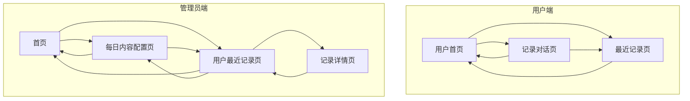

```mermaid
flowchart TD
    %% 页面流程图：以当前 ui/index.html 为准，只标明页面之间的跳转关系

    subgraph UserSide[用户端]
        UserHome[用户首页]
        RecordChat[记录对话页]
        RecentRecords[最近记录页]
    end

    subgraph AdminSide[管理员端]
        AdminHome[首页]
        DailyContentEdit[每日内容配置页]
        AdminRecordList[用户最近记录页]
        AdminRecordDetail[记录详情页]
    end

    UserHome --> RecordChat
    UserHome --> RecentRecords
    RecordChat --> UserHome
    RecordChat --> RecentRecords
    RecentRecords --> UserHome

    AdminHome --> DailyContentEdit
    AdminHome --> AdminRecordList
    DailyContentEdit --> AdminHome
    DailyContentEdit --> AdminRecordList
    AdminRecordList --> AdminHome
    AdminRecordList --> DailyContentEdit
    AdminRecordList --> AdminRecordDetail
    AdminRecordDetail --> AdminRecordList
```
