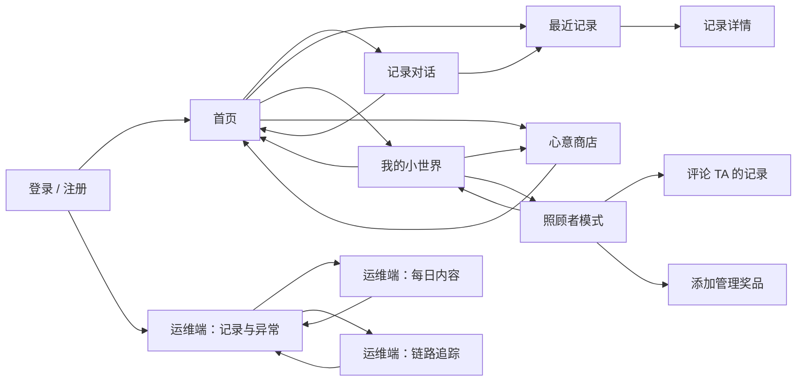

# 页面流程图

```mermaid
flowchart LR
    Login["登录 / 注册"] --> Home["首页"]
    Login --> OpsRecords["运维端：记录与异常"]

    Home --> Chat["记录对话"]
    Home --> Records["最近记录"]
    Home --> Profile["我的小世界"]
    Home --> Rewards["心意商店"]

    Records --> RecordDetail["记录详情"]
    Profile --> Home
    Profile --> Rewards
    Profile --> Care["照顾者模式"]
    Care --> CareComments["评论 TA 的记录"]
    Care --> CareRewards["添加管理奖品"]
    Care --> Profile
    Rewards --> Home
    Chat --> Home
    Chat --> Records

    OpsRecords --> OpsDaily["运维端：每日内容"]
    OpsRecords --> OpsTrace["运维端：链路追踪"]
    OpsDaily --> OpsRecords
    OpsTrace --> OpsRecords
```
