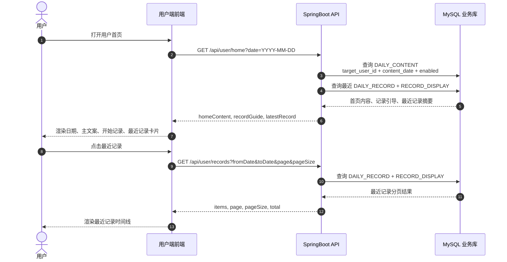

# 用户首页与最近记录序列图

用户首页和最近记录页只读取本地展示数据。飞书是同步目标，不是用户端展示查询源。

## 前后端契约重点

- 首页接口需要同时返回首页文案、记录页引导和最近记录摘要，避免前端为了首屏重复请求。
- 最近记录列表读取 `RECORD_DISPLAY`，展示 `success`、`sync_failed`、`blocked` 等状态。
- 同步失败记录仍然可以展示，因为本地 `DAILY_RECORD` 和 `RECORD_DISPLAY` 已经保存。
