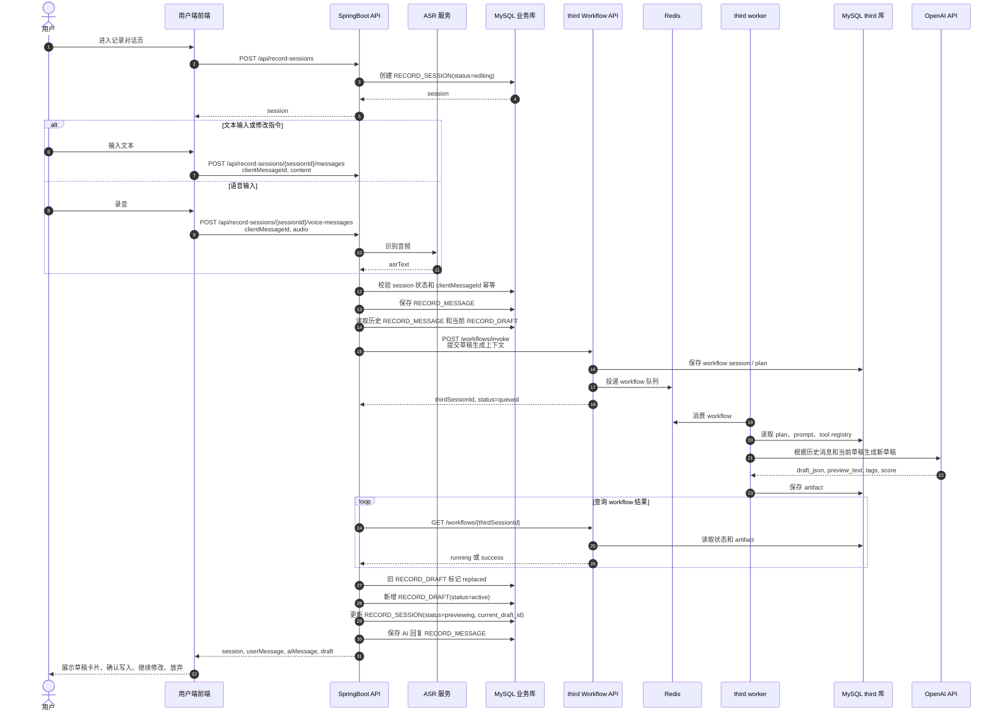

# 记录草稿生成序列图

本图覆盖记录对话页中“用户输入文本或语音 -> AI 维护草稿 -> 前端展示草稿卡片”的调用顺序。新增、修改、删除和补充说明都走同一条消息链路，由 AI 根据上下文判断意图。

## 前后端契约重点

- `clientMessageId` 必须持久化，重复提交返回第一次处理结果。
- 语音 MVP 不长期保存音频，只保存 `asrText` 到 `RECORD_MESSAGE`。
- AI 无法理解时可以只返回追问消息，不生成新 `RECORD_DRAFT`。
- 生成新草稿时旧草稿必须标记为 `replaced`，`RECORD_SESSION.current_draft_id` 指向最新草稿。
