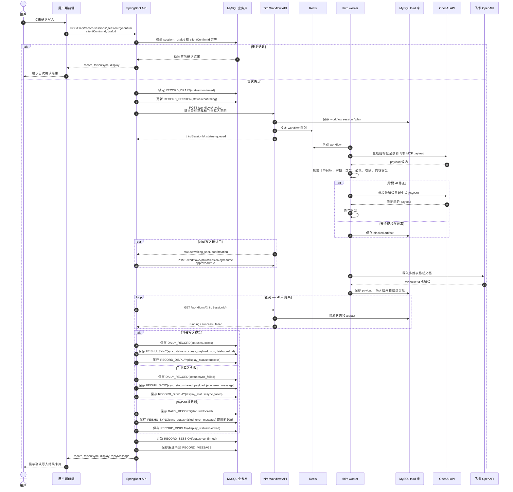

# 确认写入与飞书同步序列图

本图覆盖用户点击“确认写入”后的主链路：SpringBoot 校验业务库状态并锁定草稿，third 判断飞书 payload/schema 并调用飞书，SpringBoot 再保存本地正式记录和用户端展示数据。

## 前后端契约重点

- `clientConfirmId` 是确认写入的幂等键。
- 用户确认时必须锁定明确的 `draftId`，不能确认已经被替换的草稿。
- SpringBoot 负责 `session/draftId/clientConfirmId` 和业务表落库校验；飞书 payload/schema 必须由 `third` 校验后才能调用飞书。
- 飞书失败时接口仍可返回业务成功，因为本地正式记录和展示数据已经保存。
- `sync_failed` 和 `blocked` 都要能在用户最近记录页和管理员记录页展示。
