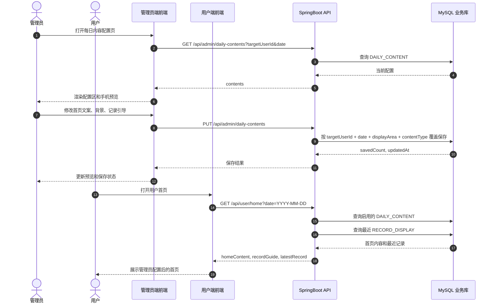

# 管理员每日内容配置序列图

本图覆盖管理员在 PC 后台保存每日内容配置，以及用户首页读取配置后的展示链路。

## 前后端契约重点

- 每日内容不局限于文案，`contentType` 可以覆盖 `text`、`background`、`card`、`reminder`、`feedback`。
- MVP 背景可以先使用预设值，不必先实现文件上传。
- 用户首页只读取启用配置；没有当天配置时后端返回默认内容。
