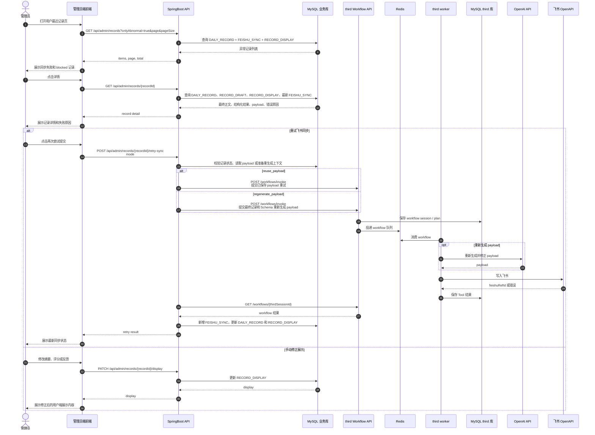

# 管理员异常处理与重试序列图

本图覆盖管理员查看记录异常、重试飞书同步，以及手动修正用户端展示内容的链路。

## 前后端契约重点

- 管理员详情页必须能看到飞书同步状态、payload 快照和错误原因。
- 重试同步建议新增 `FEISHU_SYNC` 记录，保留历史失败原因。
- `PATCH /api/admin/records/{recordId}/display` 只修改本地用户端展示，不直接修改飞书。
- 重试次数必须有限制，不能无限自动重试。
