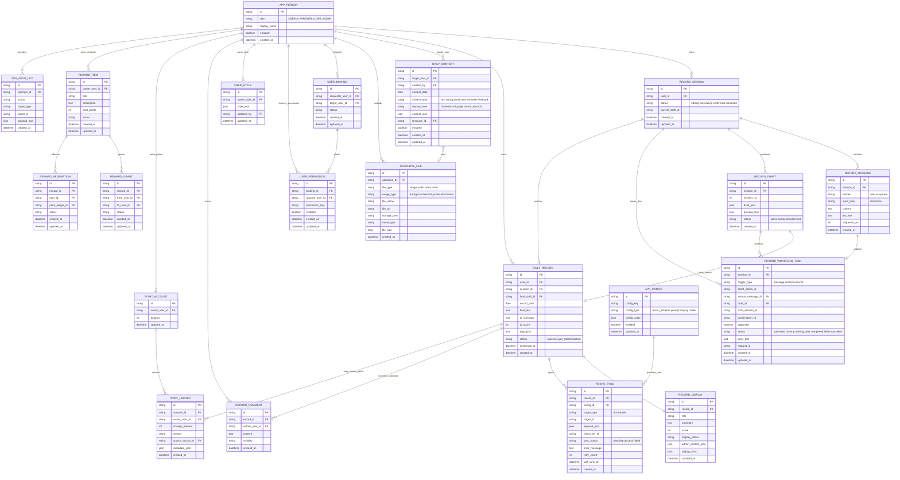

```mermaid
erDiagram
    APP_PERSON ||--o{ RECORD_SESSION : owns
    APP_PERSON ||--o{ DAILY_RECORD : owns
    APP_PERSON ||--o{ DAILY_CONTENT : target_user
    APP_PERSON ||--o{ RESOURCE_FILE : uploads
    APP_PERSON ||--o{ USER_BINDING : requests
    APP_PERSON ||--o{ USER_PERMISSION : receives_permission
    APP_PERSON ||--o| USER_STYLE : owns_style
    APP_PERSON ||--o{ RECORD_COMMENT : writes
    APP_PERSON ||--o| POINT_ACCOUNT : owns_points
    APP_PERSON ||--o{ REWARD_ITEM : owns_rewards
    APP_PERSON ||--o{ OPS_AUDIT_LOG : operates

    RECORD_SESSION ||--o{ RECORD_MESSAGE : contains
    RECORD_SESSION ||--o{ RECORD_DRAFT : produces
    RECORD_SESSION ||--o{ RECORD_WORKFLOW_TASK : tracks_third
    RECORD_SESSION ||--o| DAILY_RECORD : confirms

    RECORD_MESSAGE ||--o| RECORD_WORKFLOW_TASK : submits
    RECORD_DRAFT ||--o| DAILY_RECORD : final_version
    RECORD_DRAFT ||--o{ RECORD_WORKFLOW_TASK : confirms

    DAILY_RECORD ||--|| RECORD_DISPLAY : has
    DAILY_RECORD ||--o{ FEISHU_SYNC : syncs
    DAILY_RECORD ||--o{ RECORD_COMMENT : receives_comment
    DAILY_RECORD ||--o{ POINT_LEDGER : may_source_points

    DAILY_CONTENT }o--o| RESOURCE_FILE : uses
    APP_CONFIG ||--o{ FEISHU_SYNC : provides_rule
    USER_BINDING ||--o{ USER_PERMISSION : grants
    POINT_ACCOUNT ||--o{ POINT_LEDGER : records
    REWARD_ITEM ||--o{ REWARD_GRANT : grants
    REWARD_ITEM ||--o{ REWARD_REDEMPTION : redeems

    APP_PERSON {
        string id PK
        string role "USER or PARTNER or OPS_ADMIN"
        string display_name
        boolean enabled
        datetime created_at
    }

    RECORD_SESSION {
        string id PK
        string user_id FK
        string status "editing previewing confirmed cancelled"
        string current_draft_id
        datetime created_at
        datetime updated_at
    }

    RECORD_MESSAGE {
        string id PK
        string session_id FK
        string sender "user ai system"
        string input_type "text voice"
        text content
        text asr_text
        int sequence_no
        datetime created_at
    }

    RECORD_DRAFT {
        string id PK
        string session_id FK
        int version_no
        json draft_json
        text preview_text
        string status "active replaced confirmed"
        datetime created_at
    }

    RECORD_WORKFLOW_TASK {
        string id PK
        string session_id FK
        string trigger_type "message confirm resume"
        string client_action_id
        string source_message_id FK
        string draft_id FK
        string third_session_id
        string confirmation_id
        boolean approved
        string status "submitted running waiting_user completed failed cancelled"
        text error_text
        string request_id
        datetime created_at
        datetime updated_at
    }

    DAILY_RECORD {
        string id PK
        string user_id FK
        string session_id FK
        string final_draft_id FK
        date record_date
        text final_text
        text ai_summary
        int ai_score
        json tags_json
        string status "success sync_failed blocked"
        datetime confirmed_at
        datetime created_at
    }

    RECORD_DISPLAY {
        string id PK
        string record_id FK
        string title
        text summary
        int score
        string display_status
        json admin_content_json
        json display_json
        datetime updated_at
    }

    DAILY_CONTENT {
        string id PK
        string target_user_id FK
        string created_by FK
        date content_date
        string content_type "text background card reminder feedback"
        string display_area "home record_page recent_records"
        json content_json
        string resource_id FK
        boolean enabled
        datetime created_at
        datetime updated_at
    }

    RESOURCE_FILE {
        string id PK
        string uploaded_by FK
        string file_type "image audio video other"
        string usage_type "background record_audio attachment"
        string file_name
        string file_url
        string storage_path
        string mime_type
        long file_size
        datetime created_at
    }

    FEISHU_SYNC {
        string id PK
        string record_id FK
        string config_id FK
        string target_type "doc bitable"
        string target_id
        json payload_json
        string feishu_ref_id
        string sync_status "pending success failed"
        text error_message
        int retry_count
        datetime last_sync_at
        datetime created_at
    }

    APP_CONFIG {
        string id PK
        string config_key
        string config_type "feishu_schema prompt display model"
        json config_value
        boolean enabled
        datetime updated_at
    }

    USER_BINDING {
        string id PK
        string requester_user_id FK
        string target_user_id FK
        string status
        datetime created_at
        datetime updated_at
    }

    USER_PERMISSION {
        string id PK
        string binding_id FK
        string grantee_user_id FK
        string permission_key
        boolean enabled
        datetime created_at
        datetime updated_at
    }

    USER_STYLE {
        string id PK
        string owner_user_id FK
        json style_json
        string updated_by FK
        datetime updated_at
    }

    RECORD_COMMENT {
        string id PK
        string record_id FK
        string author_user_id FK
        text content
        string visibility
        datetime created_at
    }

    POINT_ACCOUNT {
        string id PK
        string owner_user_id FK
        int balance
        datetime updated_at
    }

    POINT_LEDGER {
        string id PK
        string account_id FK
        string owner_user_id FK
        int change_amount
        string reason
        string source_record_id FK
        json metadata_json
        datetime created_at
    }

    REWARD_ITEM {
        string id PK
        string owner_user_id FK
        string title
        text description
        int cost_points
        string status
        datetime created_at
        datetime updated_at
    }

    REWARD_GRANT {
        string id PK
        string reward_id FK
        string from_user_id FK
        string to_user_id FK
        string status
        datetime created_at
        datetime updated_at
    }

    REWARD_REDEMPTION {
        string id PK
        string reward_id FK
        string user_id FK
        string point_ledger_id FK
        string status
        datetime created_at
        datetime updated_at
    }

    OPS_AUDIT_LOG {
        string id PK
        string operator_id FK
        string action
        string target_type
        string target_id
        json payload_json
        datetime created_at
    }
```
