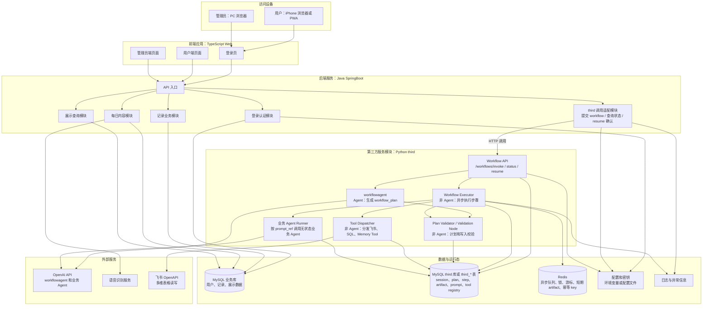

```mermaid
flowchart TB
    subgraph Client["访问设备"]
        C1["用户：iPhone 浏览器或 PWA"]
        C2["管理员：PC 浏览器"]
    end

    subgraph Frontend["前端应用：TypeScript Web"]
        F1["登录页"]
        F2["用户端页面"]
        F3["管理员端页面"]
    end

    subgraph Backend["后端服务：Java SpringBoot"]
        B0["API 入口"]
        B1["登录认证模块"]
        B2["记录业务模块"]
        B3["每日内容模块"]
        B4["展示查询模块"]
        B5["third 调用适配模块<br/>提交 workflow / 查询状态 / resume 确认"]
    end

    subgraph ThirdService["第三方服务模块：Python third"]
        T0["Workflow API<br/>/workflows/invoke / status / resume"]
        T1["workflowagent<br/>Agent：生成 workflow_plan"]
        T2["Workflow Executor<br/>非 Agent：异步执行步骤"]
        T3["Plan Validator / Validation Node<br/>非 Agent：计划和写入校验"]
        T4["Tool Dispatcher<br/>非 Agent：分发飞书、SQL、Memory Tool"]
        T5["业务 Agent Runner<br/>按 prompt_ref 调用无状态业务 Agent"]
    end

    subgraph Data["数据与运行态"]
        D1[("MySQL 业务库<br/>用户、记录、展示数据")]
        D2[("MySQL third 库或 third_* 表<br/>session、plan、step、artifact、prompt、tool registry")]
        D3[("Redis<br/>异步队列、锁、游标、短期 artifact、幂等 key")]
        D4["配置和密钥<br/>环境变量或配置文件"]
        D5["日志与异常信息"]
    end

    subgraph External["外部服务"]
        E1["OpenAI API<br/>workflowagent 和业务 Agent"]
        E2["语音识别服务"]
        E3["飞书 OpenAPI<br/>多维表格读写"]
    end

    C1 --> F1
    C2 --> F1
    F1 --> B0
    F2 --> B0
    F3 --> B0

    B0 --> B1
    B0 --> B2
    B0 --> B3
    B0 --> B4
    B0 --> B5

    B1 --> D1
    B2 --> D1
    B3 --> D1
    B4 --> D1
    B5 -->|"HTTP 调用"| T0

    T0 --> T1
    T0 --> T2
    T1 --> T3
    T2 --> T3
    T2 --> T4
    T2 --> T5

    T0 --> D2
    T2 --> D2
    T2 --> D3
    T3 --> D2
    T4 --> D2
    T5 --> D2

    B1 --> D4
    B5 --> D4
    T0 --> D4
    B5 --> D5
    T2 --> D5

    T1 --> E1
    T5 --> E1
    B3 --> E2
    T4 --> E3
```
