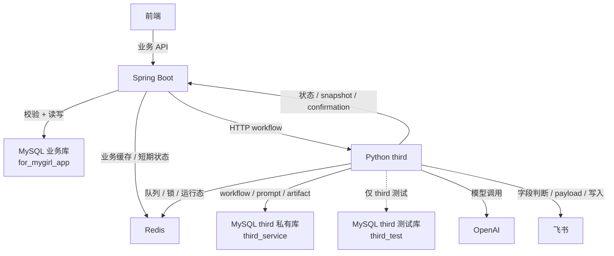

# 总架构图

```mermaid
flowchart TB
    UI["前端"] -->|"业务 API"| BS["Spring Boot"]

    BS -->|"校验 + 读写"| DB["MySQL 业务库<br/>for_mygirl_app"]
    BS -->|"业务缓存 / 短期状态"| REDIS["Redis"]
    BS -->|"HTTP workflow"| THIRD["Python third"]

    THIRD -->|"workflow / prompt / artifact"| THIRDDB["MySQL third 私有库<br/>third_service"]
    THIRD -.->|"仅 third 测试"| THIRDTEST["MySQL third 测试库<br/>third_test"]
    THIRD -->|"队列 / 锁 / 运行态"| REDIS
    THIRD -->|"模型调用"| OPENAI["OpenAI"]
    THIRD -->|"字段判断 / payload / 写入"| FEISHU["飞书"]

    THIRD -->|"状态 / snapshot / confirmation"| BS
```

## 边界

- Spring Boot 只读写 `for_mygirl_app`，负责业务库校验和落库。
- `third_service` 是 `third` 私有运行库，Spring Boot 只能通过 HTTP 获取结果。
- 飞书字段、payload 和写入安全由 `third` 判断；前端只调用 Spring Boot。
