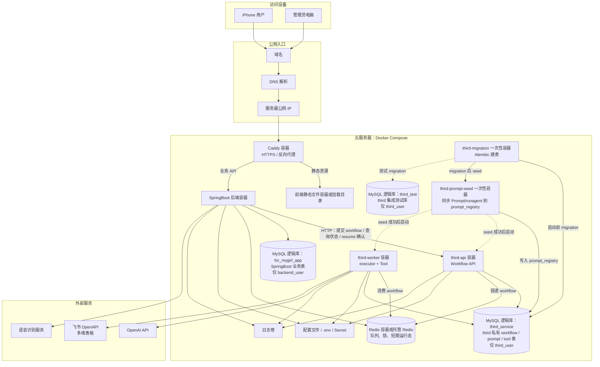

```mermaid
flowchart TB
    subgraph UserSide["访问设备"]
        A1["iPhone 用户"]
        A2["管理员电脑"]
    end

    subgraph PublicEntry["公网入口"]
        B1["域名"]
        B2["DNS 解析"]
        B3["服务器公网 IP"]
    end

    subgraph Server["云服务器：Docker Compose"]
        C1["Caddy 容器<br/>HTTPS / 反向代理"]
        C2["前端静态文件容器或挂载目录"]
        C3["SpringBoot 后端容器"]
        C4A["third-api 容器<br/>Workflow API"]
        C4B["third-worker 容器<br/>executor + Tool"]
        C4C["third-migration 一次性容器<br/>Alembic 建表"]
        C4D["third-prompt-seed 一次性容器<br/>同步 Prompt/runagent 到 prompt_registry"]
        C5A[("MySQL 逻辑库：for_mygirl_app<br/>SpringBoot 业务表<br/>仅 backend_user")]
        C5B[("MySQL 逻辑库：third_service<br/>third 私有 workflow / prompt / tool 表<br/>仅 third_user")]
        C5C[("MySQL 逻辑库：third_test<br/>third 集成测试库<br/>仅 third_user")]
        C6[("Redis 容器或托管 Redis<br/>队列、锁、短期运行态")]
        C7["配置文件 / .env / Secret"]
        C8["日志卷"]
    end

    subgraph External["外部服务"]
        D1["OpenAI API"]
        D2["语音识别服务"]
        D3["飞书 OpenAPI<br/>多维表格"]
    end

    A1 --> B1
    A2 --> B1
    B1 --> B2
    B2 --> B3
    B3 --> C1

    C1 -->|"静态资源"| C2
    C1 -->|"业务 API"| C3

    C3 -->|"HTTP：提交 workflow / 查询状态 / resume 确认"| C4A
    C3 --> C5A
    C3 --> C6
    C3 --> C7
    C3 --> C8

    C4C -->|"启动前 migration"| C5B
    C4C -->|"migration 后 seed"| C4D
    C4D -->|"写入 prompt_registry"| C5B
    C4D -.->|"seed 成功后启动"| C4A
    C4D -.->|"seed 成功后启动"| C4B
    C4A --> C5B
    C4A -->|"投递 workflow"| C6
    C4B -->|"消费 workflow"| C6
    C4B --> C5B
    C4C -.->|"测试 migration"| C5C
    C4A --> C7
    C4B --> C7
    C4A --> C8
    C4B --> C8

    C4B --> D1
    C3 --> D2
    C4B --> D3
```

说明：本图描述服务器或完整容器部署边界。本地开发阶段可以只启动 MySQL 和 Redis 容器，`third-api` 与 `third-worker` 在本机 Python 进程运行，并通过宿主机端口连接 Docker 中的 MySQL/Redis。
