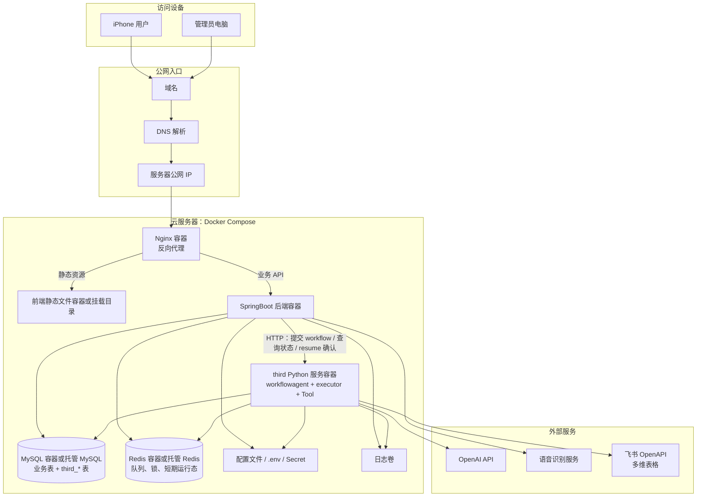

```mermaid
flowchart TB
    subgraph UserSide["访问设备"]
        A1["iPhone 用户"]
        A2["管理员电脑"]
    end

    subgraph PublicEntry["公网入口"]
        B1["域名"]
        B2["DNS 解析"]
        B3["服务器公网 IP"]
    end

    subgraph Server["云服务器：Docker Compose"]
        C1["Nginx 容器<br/>反向代理"]
        C2["前端静态文件容器或挂载目录"]
        C3["SpringBoot 后端容器"]
        C4["third Python 服务容器<br/>workflowagent + executor + Tool"]
        C5[("MySQL 容器或托管 MySQL<br/>业务表 + third_* 表")]
        C6[("Redis 容器或托管 Redis<br/>队列、锁、短期运行态")]
        C7["配置文件 / .env / Secret"]
        C8["日志卷"]
    end

    subgraph External["外部服务"]
        D1["OpenAI API"]
        D2["语音识别服务"]
        D3["飞书 OpenAPI<br/>多维表格"]
    end

    A1 --> B1
    A2 --> B1
    B1 --> B2
    B2 --> B3
    B3 --> C1

    C1 -->|"静态资源"| C2
    C1 -->|"业务 API"| C3

    C3 -->|"HTTP：提交 workflow / 查询状态 / resume 确认"| C4
    C3 --> C5
    C3 --> C6
    C3 --> C7
    C3 --> C8

    C4 --> C5
    C4 --> C6
    C4 --> C7
    C4 --> C8

    C4 --> D1
    C3 --> D2
    C4 --> D3
```
