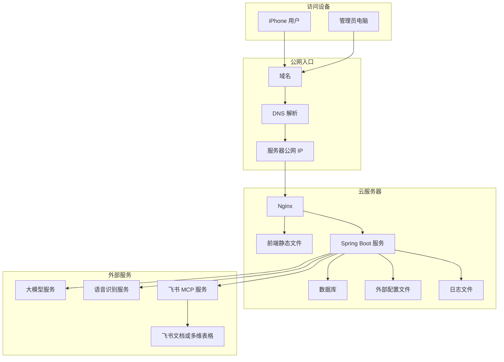

```mermaid
flowchart TB
    subgraph A["访问设备"]
        A1["iPhone 用户"]
        A2["管理员电脑"]
    end

    subgraph B["公网入口"]
        B1["域名"]
        B2["DNS 解析"]
        B3["服务器公网 IP"]
    end

    subgraph C["云服务器"]
        C1["Nginx"]
        C2["前端静态文件"]
        C3["Spring Boot 服务"]
        C4["数据库"]
        C5["外部配置文件"]
        C6["日志文件"]
    end

    subgraph D["外部服务"]
        D1["大模型服务"]
        D2["语音识别服务"]
        D3["飞书 MCP 服务"]
        D4["飞书文档或多维表格"]
    end

    A1 --> B1
    A2 --> B1

    B1 --> B2
    B2 --> B3
    B3 --> C1

    C1 --> C2
    C1 --> C3

    C3 --> C4
    C3 --> C5
    C3 --> C6

    C3 --> D1
    C3 --> D2
    C3 --> D3
    D3 --> D4
```
