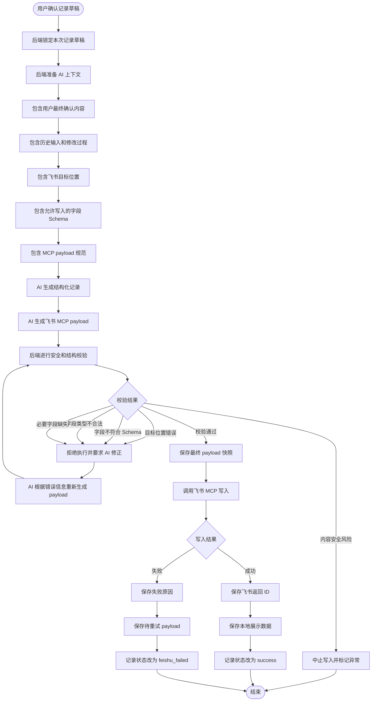

```mermaid
flowchart TD
    A([用户确认记录草稿]) --> B[后端锁定本次记录草稿]

    B --> C[后端准备 AI 上下文]
    C --> D[包含用户最终确认内容]
    D --> E[包含历史输入和修改过程]
    E --> F[包含飞书目标位置]
    F --> G[包含允许写入的字段 Schema]
    G --> H[包含 MCP payload 规范]

    H --> I[AI 生成结构化记录]
    I --> J[AI 生成飞书 MCP payload]

    J --> K[后端进行安全和结构校验]

    K --> L{校验结果}

    L -- 目标位置错误 --> M[拒绝执行并要求 AI 修正]
    L -- 字段不符合 Schema --> M
    L -- 字段类型不合法 --> M
    L -- 必要字段缺失 --> M
    L -- 内容安全风险 --> N[中止写入并标记异常]
    L -- 校验通过 --> O[保存最终 payload 快照]

    M --> P[AI 根据错误信息重新生成 payload]
    P --> K

    O --> Q[调用飞书 MCP 写入]
    Q --> R{写入结果}

    R -- 成功 --> S[保存飞书返回 ID]
    S --> T[保存本地展示数据]
    T --> U[记录状态改为 success]

    R -- 失败 --> V[保存失败原因]
    V --> W[保存待重试 payload]
    W --> X[记录状态改为 feishu_failed]

    N --> Y([结束])
    U --> Y
    X --> Y
```
