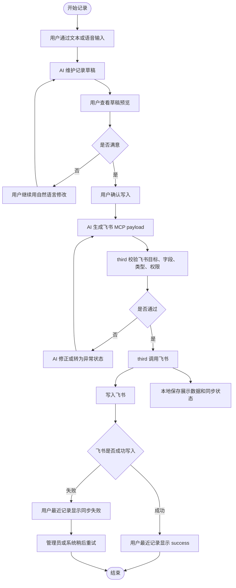

```mermaid
flowchart TD
    A(["开始记录"]) --> B["用户通过文本或语音输入"]
    B --> C["AI 维护记录草稿"]
    C --> D["用户查看草稿预览"]

    D --> E{"是否满意"}

    E -->|否| F["用户继续用自然语言修改"]
    F --> C

    E -->|是| G["用户确认写入"]
    G --> H["AI 生成飞书 MCP payload"]
    H --> I["third 校验飞书目标、字段、类型、权限"]

    I --> J{"是否通过"}

    J -->|否| K["AI 修正或转为异常状态"]
    K --> H

    J -->|是| L["third 调用飞书"]
    L --> M["写入飞书"]
    L --> N["本地保存展示数据和同步状态"]

    M --> O{"飞书是否成功写入"}

    O -->|成功| P["用户最近记录显示 success"]
    O -->|失败| Q["用户最近记录显示同步失败"]
    Q --> R["管理员或系统稍后重试"]

    P --> S(["结束"])
    R --> S
```
