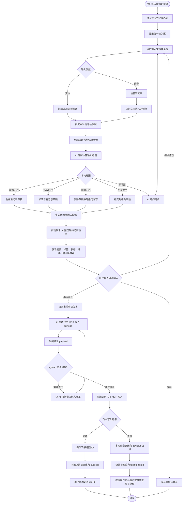

```mermaid
flowchart TD
    A([用户进入新增记录页]) --> B[进入对话式记录界面]

    B --> C[显示统一输入区]
    C --> D[用户输入文本或语音]

    D --> E{输入类型}

    E -- 文本 --> F[前端追加文本消息]
    E -- 语音 --> G[语音转文字]
    G --> H[识别文本进入对话框]

    F --> I[提交本轮消息给后端]
    H --> I

    I --> J[后端读取当前记录会话]
    J --> K[AI 理解本轮输入意图]

    K --> L{本轮意图}

    L -- 新增内容 --> M[合并进记录草稿]
    L -- 修改内容 --> N[修改已有记录草稿]
    L -- 删除内容 --> O[删除草稿中的指定内容]
    L -- 补充说明 --> P[补充到相关字段]
    L -- 不清楚 --> Q[AI 追问用户]

    Q --> D

    M --> R[生成新的待确认草稿]
    N --> R
    O --> R
    P --> R

    R --> S[前端展示 AI 整理后的记录预览]
    S --> T[展示摘要、标签、状态、评分、建议等内容]

    T --> U{用户是否确认写入}

    U -- 继续修改 --> D
    U -- 放弃 --> V[保存草稿或丢弃]
    U -- 确认写入 --> W[锁定当前草稿版本]

    W --> X[AI 生成飞书 MCP 写入 payload]
    X --> Y[后端校验 payload]
    Y --> Z{payload 是否可执行}

    Z -- 需要修正 --> AA[让 AI 根据错误信息修正]
    AA --> X

    Z -- 通过校验 --> AB[后端调用飞书 MCP 写入]

    AB --> AC{飞书写入结果}

    AC -- 成功 --> AD[保存飞书返回 ID]
    AD --> AE[本地记录状态改为 success]
    AE --> AF[用户端刷新最近记录]

    AC -- 失败 --> AG[本地保留记录和 payload 快照]
    AG --> AH[记录状态改为 feishu_failed]
    AH --> AI[提示用户稍后重试或等待管理员处理]

    AF --> AJ([结束])
    AI --> AJ
    V --> AJ
```
