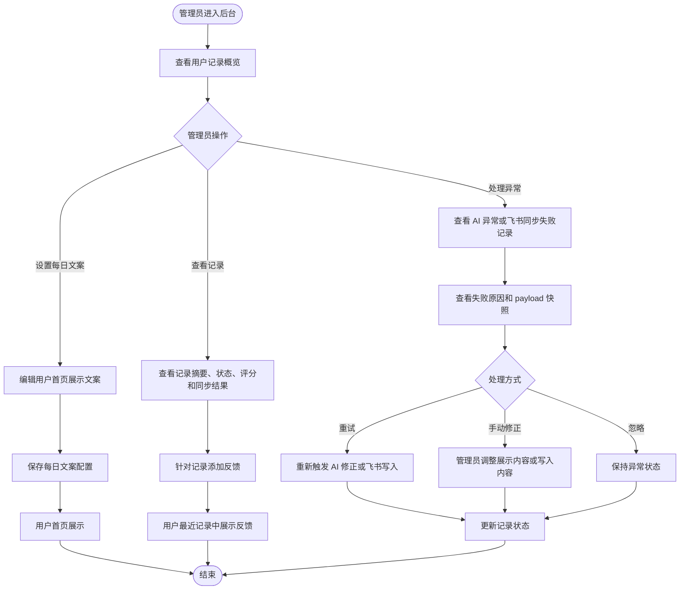

```mermaid
flowchart TD
    A([管理员进入后台]) --> B[查看用户记录概览]

    B --> C{管理员操作}

    C -- 设置每日文案 --> D[编辑用户首页展示文案]
    D --> E[保存每日文案配置]
    E --> F[用户首页展示]

    C -- 查看记录 --> G[查看记录摘要、状态、评分和同步结果]
    G --> H[针对记录添加反馈]
    H --> I[用户最近记录中展示反馈]

    C -- 处理异常 --> J[查看 AI 异常或飞书同步失败记录]
    J --> K[查看失败原因和 payload 快照]
    K --> L{处理方式}

    L -- 重试 --> M[重新触发 AI 修正或飞书写入]
    L -- 手动修正 --> N[管理员调整展示内容或写入内容]
    L -- 忽略 --> O[保持异常状态]

    M --> P[更新记录状态]
    N --> P
    O --> P

    F --> Q([结束])
    I --> Q
    P --> Q
```
