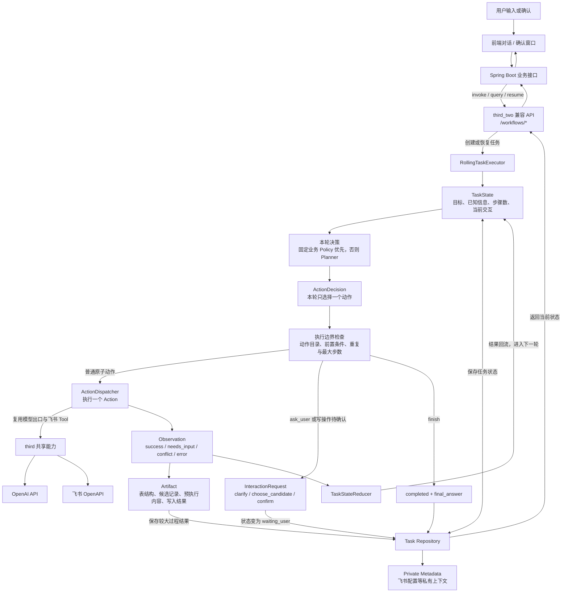

# third_two 滚动 Agent 总架构图

说明：`third_two` 是当前默认运行的 Agent 服务。Spring Boot 继续通过兼容的 `/workflows/*` 接口提交任务、查询状态和恢复用户交互；`third_two` 内部不再使用旧 `third` 的 workflow 模板、Redis 队列和独立 worker，而是在 API 进程内围绕同一个 `TaskState` 滚动执行。每一轮只产生一个 `ActionDecision`，执行一个原子动作，再把 `Observation` 回流到任务状态，直到完成、失败或需要用户补充与确认。

## 滚动执行流程

1. 前端把用户输入交给 Spring Boot，Spring Boot 调用 `third_two` 兼容 API。
2. 兼容层把原有 workflow 请求转换为新任务，创建结构化 `TaskState`，并把飞书配置等信息单独保存为私有上下文。
3. `RollingTaskExecutor` 读取最新状态。明确、稳定的业务操作先由 `Policy` 决定必需步骤，其余场景由 `Planner` 根据当前状态和最新 Artifact 选择本轮动作。
4. Planner 每轮只能返回一个 `ActionDecision`，不能一次生成整条固定执行计划。
5. Executor 校验动作是否存在、写入前置条件是否满足、动作是否连续重复，以及是否超过 `max_steps`。
6. `ActionDispatcher` 每轮只执行一个原子动作，并统一返回 `Observation`；表结构、候选记录、预执行内容等较大结果保存为 Artifact。
7. `TaskStateReducer` 把 Observation 回流到 TaskState。若任务仍可继续，则带着新状态进入下一轮决策。
8. 需要追问、候选选择或写入确认时，任务进入 `waiting_user`。用户在前端回答、修改、确认或取消后，Spring Boot 调用 `resume`，同一个任务从暂停位置继续。
9. Planner 选择 `finish` 后生成 `final_answer`，兼容层再把任务状态转换成 Spring Boot 仍在使用的 workflow 响应。

## Runtime 内部职责

- `compat/`：保持 Spring Boot 已使用的 `/workflows/invoke`、状态查询、`resume`、snapshot、timeline 和 artifacts 契约，对内映射为新 Task API。
- `RollingTaskExecutor`：控制滚动循环、单步执行、用户交互暂停、写入确认、幂等去重、连续重复保护和最大步数限制。
- `Policy`：处理必须稳定执行的业务小流程，例如 `draft_generate`，避免这类流程被 Planner 随意改写。
- `Planner`：读取公开的 TaskState 和最新 Artifact，只决定这一轮最合适的一个动作。
- `Action Catalog`：定义 Planner 可以选择的动作、参数、动作类型和安全边界。
- `ActionDispatcher`：执行读取、匹配、准备、写入和字段变更等原子动作，并复用 `third` 中的 OpenAI 出口与飞书 Tool。
- `TaskStateReducer`：把动作结果转换为事实、缺失信息、已完成动作、错误和下一轮所需状态。
- `Task Repository`：隔离 TaskState、Artifact 和 Private Metadata；当前实现为进程内存储，可替换为持久化实现。
- `debug/`：本地开发时展示任务状态、步骤数、每轮 Decision、Observation、Artifact 和待处理交互，不进入正式业务调用链。

## TaskState、Artifact 和私有上下文分工

- `TaskState` 保存跨轮次所需的紧凑状态，包括目标、用户事件、已知字段、缺失字段、最近一次决策与观察、步骤数和待处理交互。
- `Artifact` 保存表结构、候选记录、`prepared_operation`、写入结果等较大过程数据；Planner 只读取每类 Artifact 的最新值。
- `Private Metadata` 保存飞书 App、表格等调用配置，不进入 `TaskState.planner_view()`，也不直接发送给 Planner。
- 当前 `InMemoryTaskRepository` 会在容器或进程重启后丢失未完成任务，这是现阶段与旧持久化 workflow Runtime 的主要差异。
- `third_two` 核心流程不依赖 Redis 队列，也没有独立的 `third-worker`；Redis 和旧 `third_service` workflow 表不保存当前 TaskState。

## Spring Boot 和 third_two 边界

- Spring Boot 负责稳定业务 API、登录与权限、业务会话、业务数据库以及前端需要的响应整形。
- `third_two` 负责自然语言任务拆解、滚动决策、飞书读写、用户交互状态和 Agent 过程结果。
- Spring Boot 不直接读取 `third_two` 的内部 TaskState；通过兼容 API 查询状态、时间线和 Artifact。
- `third_two` 不直接写 Spring Boot 业务库；需要业务落库的结果仍由 Spring Boot 接收后处理。

## 本地开发和 Docker 边界

- 根目录 `docker-compose.yml` 默认启动 `third-two-api`，Spring Boot 容器通过 `THIRD_BASE_URL=http://third-two-api:8000` 调用它。
- 原 `third-api` 和 `third-worker` 只在 `third-legacy` profile 中保留，用于旧流程对照，不属于默认运行链路。
- 本机直接开发可用 `uvicorn third_two.api:app --host 0.0.0.0 --port 8001 --reload`。
- 代码在 Docker 中运行时，修改后必须重建 `third-two-api` 镜像；只重启旧容器不会加载新的镜像内容。
- `THIRD_DEBUG_ENABLED` 只应在本地调试时开启，正式环境保持关闭。

## 动作与写入安全策略

- 读取类动作可以直接执行；新增、更新、删除和字段变更必须先生成对应的 `prepared_operation`。
- 更新和删除必须先匹配到唯一 `record_id`，不能让 Planner 直接猜测目标记录。
- 所有飞书写操作都先进入 `confirm`，用户可以确认、修改或取消；修改内容会作为新的用户事件回流后重新规划。
- 已确认的写入动作使用基于任务、动作参数和预执行内容生成的哈希做幂等控制，避免重复副作用。
- 连续选择相同动作或超过最大步骤数时，Executor 主动停止任务，避免 Planner 无限循环。
- `draft_generate` 只生成业务草稿，不会被自动转换为飞书写入动作。
