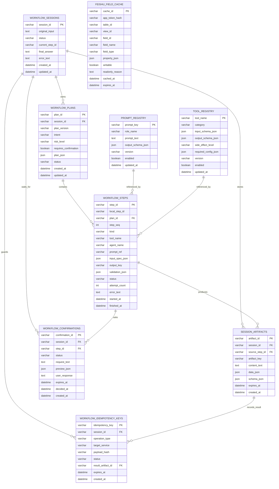

# workflow 数据库 ER 图

说明：本文件记录 `third` 的 workflow 存储设计。MySQL 负责可恢复、可审计的数据；Redis 负责短期运行态、队列、锁和幂等缓存。

## MySQL ER 图

## 表说明

### workflow_sessions

保存一次 workflow 的总状态。

| 字段 | 说明 |
|---|---|
| `session_id` | 一次 workflow 的唯一 ID，SpringBoot 后续用它查询状态或 resume。 |
| `original_input` | 用户原始输入文本。 |
| `status` | `queued`、`running`、`waiting_user`、`success`、`failed` 等状态。 |
| `current_step_id` | 当前执行到的步骤 ID。 |
| `final_answer` | workflow 最终返回给用户的 `content[0].text`。 |
| `error_text` | workflow 失败时的错误摘要。 |
| `created_at` / `updated_at` | 创建和更新时间。 |

### workflow_plans

保存 `workflowagent` 生成的完整计划。

| 字段 | 说明 |
|---|---|
| `plan_id` | 计划 ID。 |
| `session_id` | 所属 workflow session。 |
| `plan_version` | workflow plan 结构版本，例如 `workflow.v1`。 |
| `intent` | 总意图，例如 `create_feishu_record`、`update_feishu_record`。 |
| `risk_level` | 风险等级，例如 `read`、`write`、`delete`。 |
| `requires_confirmation` | 是否需要用户确认。写入、更新、删除默认需要。 |
| `plan_json` | workflowagent 输出的完整 JSON。 |
| `status` | `planned`、`running`、`completed`、`failed`。 |

### workflow_steps

保存计划中的每一个可执行步骤。

| 字段 | 说明 |
|---|---|
| `step_id` | 数据库全局步骤 ID，由 `plan_id + local_step_id` 派生，避免不同 session 的固定步骤名冲突。 |
| `local_step_id` | workflow plan 内的本地步骤 ID，例如 `step_read_records`。同一个 `plan_id` 内唯一。 |
| `plan_id` | 所属计划。 |
| `step_seq` | 步骤顺序。 |
| `kind` | `tool`、`agent`、`validation`、`confirm`、`answer`。 |
| `tool_name` | Tool 步骤使用的工具名。 |
| `agent_name` | Agent 步骤使用的业务 Agent 名。 |
| `prompt_ref` | Agent 步骤使用的提示词引用。 |
| `input_spec_json` | 当前步骤需要从哪些 artifact 读取输入。 |
| `output_key` | 当前步骤输出保存到 `session_artifacts.artifact_key` 的 key。 |
| `validation_json` | 当前步骤的校验规则。 |
| `status` | `pending`、`running`、`success`、`failed`、`waiting_user`。 |
| `attempt_count` | 当前步骤已尝试次数。 |
| `error_text` | 当前步骤失败原因。 |

### session_artifacts

保存步骤之间传递的中间结果。

| 字段 | 说明 |
|---|---|
| `artifact_id` | artifact ID。 |
| `session_id` | 所属 workflow session。 |
| `source_step_id` | 产生该 artifact 的步骤 ID。 |
| `artifact_key` | 逻辑 key，例如 `feishu.table_schema`、`feishu.record_payload`。 |
| `content_text` | 保留 `content[0].text` 形式的文本。 |
| `data_json` | 结构化结果。 |
| `schema_json` | 该 artifact 对应的数据结构约束。 |
| `expires_at` | 可选过期时间，短期 artifact 可清理。 |

### workflow_confirmations

保存需要用户确认的写入、更新、删除步骤。

| 字段 | 说明 |
|---|---|
| `confirmation_id` | 确认记录 ID。 |
| `session_id` | 所属 workflow session。 |
| `step_id` | 等待确认的步骤 ID。 |
| `status` | `waiting`、`approved`、`rejected`、`expired`。 |
| `request_text` | 展示给用户确认的文本。 |
| `preview_json` | 即将写入或修改的数据预览。 |
| `user_response` | 用户确认或拒绝的原始回复。 |
| `expires_at` | 确认超时时间。 |
| `decided_at` | 用户做出选择的时间。 |

### workflow_idempotency_keys

保存写入类操作的幂等信息，防止重试造成重复副作用。

| 字段 | 说明 |
|---|---|
| `idempotency_key` | 幂等 key，通常由操作类型和 payload hash 生成。 |
| `session_id` | 首次产生该 key 的 session。 |
| `operation_type` | `create_record`、`update_record`、`delete_record`。 |
| `target_service` | 目标服务，例如 `feishu_bitable`。 |
| `payload_hash` | 规范化写入 payload 的 hash。 |
| `status` | `running`、`success`、`failed`。 |
| `result_artifact_id` | 已成功执行时对应的结果 artifact。 |
| `expires_at` | 幂等记录过期时间，避免永久堆积。 |

### prompt_registry

保存可被 Agent Runner 使用的提示词。

| 字段 | 说明 |
|---|---|
| `prompt_key` | 提示词 key，例如 `parse_feishu_record.v1`。 |
| `role_name` | 提示词对应的角色，例如 `parser_agent`。 |
| `prompt_text` | 提示词正文。 |
| `output_schema_json` | 该提示词要求的输出结构。 |
| `version` | 提示词版本。 |
| `enabled` | 是否启用。 |

### tool_registry

保存 Tool 的注册信息。

| 字段 | 说明 |
|---|---|
| `tool_name` | Tool 名称。 |
| `category` | `feishu`、`sql`、`memory`、`validation` 等分类。 |
| `input_schema_json` | Tool 输入结构。 |
| `output_schema_json` | Tool 输出结构。 |
| `side_effect_level` | `none`、`read`、`write`、`delete`。 |
| `required_config_json` | Tool 所需配置项。 |
| `version` | Tool 版本。 |
| `enabled` | 是否启用。 |

### feishu_field_cache

缓存飞书多维表格字段定义，用于字段对齐和写入校验。

| 字段 | 说明 |
|---|---|
| `cache_id` | 字段缓存记录 ID。 |
| `app_token_hash` | 飞书 app token 的 hash，避免明文存储。 |
| `table_id` | 飞书多维表格 table id。 |
| `view_id` | 视图 ID，可为空。 |
| `field_id` | 飞书字段 ID。 |
| `field_name` | 字段名。 |
| `field_type` | 飞书字段类型。 |
| `property_json` | 字段配置，例如选项、格式等。 |
| `writable` | 是否可写。 |
| `readonly_reason` | 不可写原因，例如公式、自动编号、创建时间等。 |
| `cached_at` | 缓存写入时间。 |
| `expires_at` | 字段缓存过期时间；过期后重新拉取飞书字段。 |

## Redis Key 设计

Redis 不作为最终事实来源，只保存短期运行态。

| Key | 类型 | TTL | 作用 |
|---|---|---|---|
| `third:workflow:queue` | Stream 或 List | 无固定 TTL | 异步 workflow 任务队列。 |
| `third:workflow:lock:{session_id}` | String | 1 到 5 分钟 | 防止同一个 session 被多个 worker 同时执行。 |
| `third:workflow:cursor:{session_id}` | String 或 Hash | 1 到 24 小时 | 缓存当前步骤游标，MySQL 仍保存最终状态。 |
| `third:artifact:temp:{session_id}:{artifact_key}` | String | 10 到 60 分钟 | 缓存短期 artifact，减少频繁读 MySQL。 |
| `third:idempotency:{idempotency_key}` | String 或 Hash | 1 到 7 天 | 防止写入类操作重试后重复执行。 |
| `third:feishu:schema:refreshing:{table_key}` | String | 30 到 120 秒 | 字段缓存刷新锁，防止多个 worker 同时刷新同一张表字段。 |

## 字段缓存 TTL 刷新规则

1. 读写飞书前先查 MySQL 的 `feishu_field_cache`。
2. 如果没有缓存，或 `expires_at` 已过期，则尝试获取 Redis 刷新锁。
3. 获取锁的 worker 调飞书字段接口，刷新 MySQL 缓存。
4. 没获取锁的 worker 可以短暂等待，之后重新读取 MySQL 缓存。
5. 如果写入校验出现字段不存在，也可以触发一次强制刷新，再重新校验。

## 幂等执行规则

1. 写入、更新、删除前，对规范化后的请求生成 `payload_hash`。
2. 用 `operation_type + target_service + payload_hash` 生成 `idempotency_key`。
3. 执行前先查 Redis 和 MySQL 是否已有相同 key。
4. 如果已有成功结果，直接返回历史结果，不再次调用飞书。
5. 如果 key 正在执行，当前任务等待或返回稍后查询。
6. 如果首次执行，则写入 `running`，执行成功后更新为 `success` 并记录结果 artifact。
