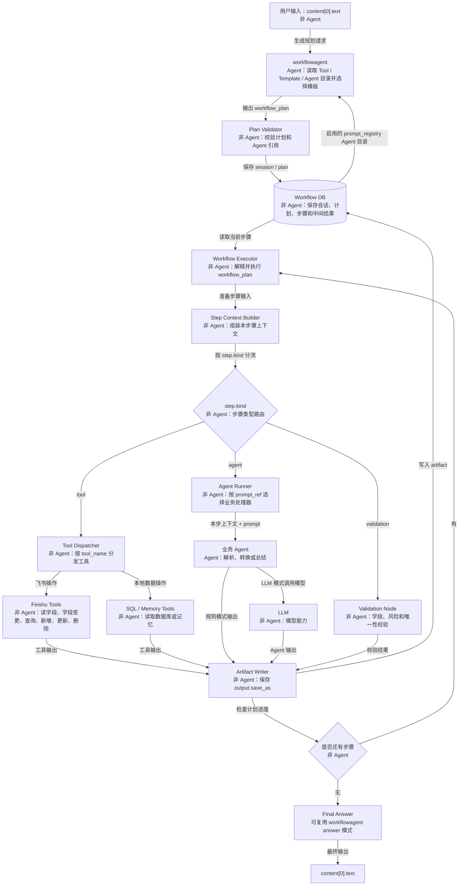

# workflowagent 固定执行图

## 固定图

说明：这张图描述的是固定 LangGraph 结构。动态变化的不是节点，而是 `workflowagent` 选择的 workflow template 以及由模板 builder 生成的 `workflow_plan.steps`。



## 节点职责

| 节点 | 是否 Agent | 作用 |
|---|---|---|
| 用户输入 | 否 | 接收外部自然语言请求，入口仍然只使用 `content[0].text`。 |
| `workflowagent` | 是 | LLM 模式下拿到 Tool 能力目录、Workflow Template 目录和数据库启用的 Agent 目录，优先选择 `template_key`，由代码模板 builder 生成完整 `workflow_plan.steps`。 |
| Tool 能力目录 | 否 | 由代码内置，告诉 workflowagent 每个 `tool_name` 的用途、适用场景、副作用等级、输入输出和是否需要确认。 |
| `Plan Validator` | 否 | 校验计划是否能执行，防止不存在的 Tool、错误依赖、未注册 `agent_name/prompt_ref`、写入前缺少字段读取、更新或删除缺少候选匹配、把明显写入飞书请求误规划成读取等问题。 |
| `Workflow DB` | 否 | 保存系统状态，包括 session、plan、step、artifact。Agent 不保存长期状态。 |
| `Workflow Executor` | 否 | 固定执行器，读取当前步骤并决定进入 Tool、Agent 或 Validation。 |
| `Step Context Builder` | 否 | 从 DB 取出本步骤需要的 artifact，只把当前步骤需要的信息交给执行对象。 |
| `step.kind` 路由 | 否 | 根据步骤类型分流，例如 `tool`、`agent`、`validation`。 |
| `Tool Dispatcher` | 否 | 根据 `tool_name` 调用对应 Tool，不做语义判断。 |
| `Agent Runner` | 否 | 根据 `prompt_ref` 选择当前支持的业务处理器，只从 `prompt_registry` 读取提示词；数据库没有记录时当前步骤失败。它是运行容器，不是 Agent。 |
| 业务 Agent | 是 | 每次只处理当前步骤，例如解析自然语言、按字段 schema 生成 payload、从候选记录匹配目标记录。`parse_feishu_record.v1` 负责写入 payload 解析，`parse_feishu_schema_change.v1` 负责字段变更 payload 解析，`search_feishu_record.v1` 负责更新/删除前的候选记录语义匹配。 |
| `LLM` | 否 | 模型能力本身，不等于 Agent。 |
| `Validation Node` | 否 | 写入和字段变更前做硬校验，例如字段是否存在、字段类型是否可写、字段变更 actions 是否安全、批量新增每条记录是否合法、把 `feishu.record_match` 的 `record_id` 合并到更新/删除请求、生成确认预览和幂等 key。 |
| `Feishu Tools` | 否 | 执行飞书多维表格能力，包括读字段、字段变更、查记录、新增、更新、删除。 |
| `SQL / Memory Tools` | 否 | 读取本地数据库、历史对话或用户记忆。 |
| `Artifact Writer` | 否 | 把每一步输出保存到 `session_artifacts`，供后续步骤按 key 引用。 |
| 是否还有步骤 | 否 | 判断计划是否继续执行，决定回到 Executor 或进入最终回答。 |
| `Final Answer` | 可选 | 可以是确定性格式化节点，也可以复用 `workflowagent` 的 answer 模式。最终只输出 `content[0].text`。 |

## 无状态 Agent 的执行方式

Agent 每一轮都可以是无知的，但 `Workflow DB` 和 `Executor` 不能无状态。执行每一步前，`Step Context Builder` 会把当前步骤需要的内容裁剪出来。

示例：字段转换步骤只会拿到当前任务、飞书字段 schema、记忆查询结果和输出约束。

```json
{
  "step_id": "2",
  "task": "把用户今早记录转换成飞书写入 payload",
  "input_artifacts": {
    "feishu.table_schema": {
      "fields": ["标题", "日期", "内容", "状态"]
    },
    "memory.morning_events": {
      "content": "今天早上完成了项目第三方服务模块工作流设计"
    }
  },
  "output_schema": {
    "artifact_key": "feishu.record_payload",
    "fields": {
      "标题": "string",
      "日期": "date",
      "内容": "string",
      "状态": "string"
    }
  },
  "constraints": {
    "reject_unknown_fields": true,
    "must_match_feishu_schema": true,
    "only_output_json": true
  }
}
```

这样业务 Agent 不需要知道完整历史，也不能越过当前步骤直接写入。写入必须等字段读取、字段转换和校验步骤都完成后，由 Executor 调用写入 Tool。

## 更新和删除的动态步骤

新增记录通常是 `read_schema -> business_agent -> validation -> confirm -> create_tool`。

更新或删除已有记录时，workflowagent 必须规划为：

```text
read_schema -> business_agent -> read_candidate_records -> search_agent -> validation -> confirm -> update/delete_tool
```

其中 `tool_ReadFeishuBitable` 只读取候选记录，`search_agent/search_feishu_record.v1` 只从候选中选择 `record_id` 并给出置信度、理由和备选候选。低置信匹配会进入确认门，但确认文案和 `preview_json.match_info` 会提示用户核对后再确认。

## 字段变更的动态步骤

字段变更不新增固定图节点，仍然由 workflowagent 选择 template 后交给代码模板生成步骤：

```text
read_schema -> schema_agent -> schema_validation -> confirm -> change_fields_tool -> refresh_schema
```

其中 `schema_agent/parse_feishu_schema_change.v1` 只生成候选 `schema_change_request.actions`；字段是否重复、字段类型是否允许、删除字段风险和确认预览由 `Validation Node` 决定。`tool_ChangeFeishuBitableFields` 执行成功后必须刷新 `feishu.table_schema_after`。

当用户一句话同时要求改字段再新增记录时，使用组合模板：

```text
read_schema -> schema_agent -> schema_validation -> confirm_schema_change -> change_fields_tool -> refresh_schema -> business_agent -> validation -> confirm_write -> create_tool
```

也就是说，记录写入必须使用字段变更后的 `feishu.table_schema_after`，不能继续使用旧 schema。
