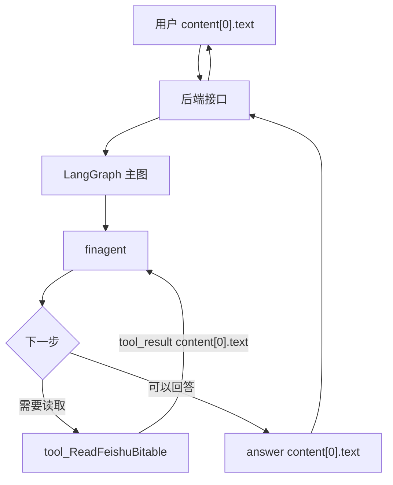

```mermaid
flowchart TD
    U["用户 content[0].text"] --> BE["后端接口"]
    BE --> G["LangGraph 主图"]

    G --> FA["finagent"]
    FA --> D{"下一步"}

    D -->|"需要读取"| TR["tool_ReadFeishuBitable"]
    D -->|"可以回答"| A["answer content[0].text"]

    TR -->|"tool_result content[0].text"| FA
    A --> BE
    BE --> U
```
