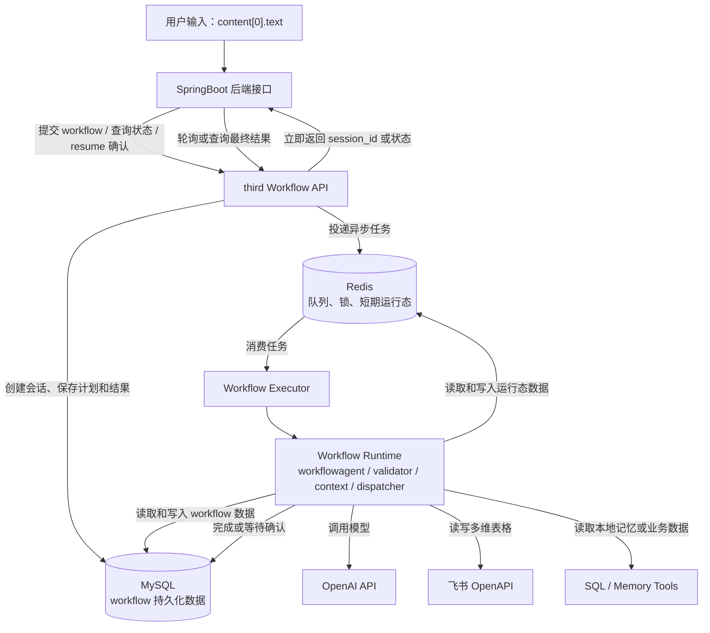

# third 第三方服务模块总架构图

说明：`third` 作为独立 Python 服务运行。SpringBoot 后端通过 HTTP 提交 workflow、查询状态、恢复确认后的任务；`third` 内部异步执行 workflow，并直接连接 Redis、MySQL、OpenAI 和飞书 OpenAPI。

## 异步执行流程

1. SpringBoot 接收用户请求后，调用 `third Workflow API`。
2. `third` 创建 `workflow_session`，把任务投递到 Redis 队列，并立即返回 `session_id`。
3. `Workflow Executor` 从 Redis 消费任务，读取 MySQL 中的 session、plan、step 和 artifact。
4. 没有可执行计划时，由 `workflowagent` 读取数据库 Agent 目录并生成 `workflow_plan`，再由 `Plan Validator` 校验工具和 Agent 引用。
5. Executor 按步骤调用 Tool、业务 Agent 或校验节点，每一步结果都保存为 artifact。
6. 写入、更新、删除前进入确认门，状态变为 `waiting_user`。
7. SpringBoot 后续补充用户确认逻辑后，调用 `resume` 接口继续执行。
8. workflow 完成后，最终答案保存到 MySQL，SpringBoot 通过状态查询接口获取结果。

## Runtime 内部职责

- `workflowagent`：Agent，LLM 模式下拿到代码内置 Tool 能力目录，并读取 MySQL `prompt_registry` 中启用的 Agent 目录，再生成 `workflow_plan`，不直接写入飞书。
- `Workflow Executor`：非 Agent，负责解释并执行 `workflow_plan.steps`。
- `Plan Validator`：非 Agent，校验工具名、Agent 引用、步骤依赖、写入前置条件和风险等级。
- `Step Context Builder`：非 Agent，只把当前步骤需要的 artifact 组装给当前 Tool 或业务 Agent。
- `Tool Dispatcher`：非 Agent，根据 `tool_name` 调用飞书、SQL、Memory 等 Tool。
- `Agent Runner`：非 Agent，按 `prompt_ref` 选择当前支持的无状态业务处理器；业务提示词只读取 MySQL `prompt_registry`，没有记录时当前步骤失败。
- `Validation Node`：非 Agent，负责字段对齐、类型校验、唯一定位校验。
- `Confirm Gate`：非 Agent，写入、更新、删除前暂停 workflow，等待 SpringBoot 传回用户确认。

## Redis 和 MySQL 分工

- MySQL 是最终事实来源，保存 session、plan、step、artifact、prompt registry、tool registry、字段缓存和执行结果。
- Redis 保存异步队列、执行锁、当前步骤游标、短期 artifact、幂等 key 和字段缓存刷新锁。
- Redis 中的数据可以过期或丢失；关键状态必须能从 MySQL 恢复。
- MySQL 中的字段缓存使用 `expires_at` 控制 TTL；缓存过期后，下一次读写飞书前重新拉取字段定义。

## 本地开发和 Docker 边界

- 当前本地开发默认只用 `docker-compose.yml` 启动 `mysql` 和 `redis`，不构建 third 镜像。
- `third-api` 和 `third-worker` 在本机 Python 进程里运行，连接 `127.0.0.1:3307` 和 `127.0.0.1:6380`。
- 本地 API 可以用 `uvicorn --reload`，修改 `third` 代码后自动重启 API 进程。
- worker 当前用 `python -m third.worker` 启动，修改 worker 相关代码后手动重启即可。
- 后续服务器部署或完整容器链路验证时，使用 `third-container` profile 启动 `third-migration`、`third-api`、`third-worker` 容器。
- 完整 third 容器模式下，`third-api` 和 `third-worker` 使用同一个 `third/Dockerfile` 镜像，职责通过启动命令区分。
- Docker 和联调环境建议保持 `THIRD_ALLOW_IN_MEMORY_FALLBACK=0`，MySQL 或 Redis 连接失败时直接暴露错误。

## 写入安全策略

- 写入、更新、删除前必须先读取飞书字段，并通过字段校验。
- 更新和删除必须能唯一定位记录，定位到 0 条或多条都不执行。
- 写入类操作必须生成 `idempotency_key`，防止重试时重复新增或重复执行副作用。
- 写入、更新、删除默认进入 `waiting_user`，由 SpringBoot 后续实现确认界面和 `resume` 调用。
- 当前不设计权限传递；飞书访问能力与自建应用配置对齐，由飞书自建应用和后端业务入口共同约束。
