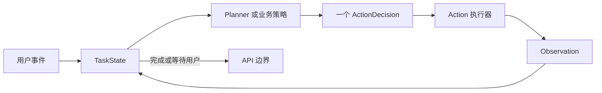
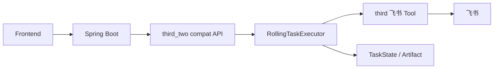

# third_two 架构与模块边界

`third_two` 现在是本地 Docker 默认 Agent。它复用 `third` 的 LLM 出口和飞书 Tool，但不复用旧 Template Executor。

## 主循环

每一轮只执行一个动作。`no_match`、`needs_input`、`conflict` 会作为 Observation 回到 TaskState，下一轮再决定追问、换条件或继续执行。

## 模块分离

| 模块 | 负责 | 不负责 |
|---|---|---|
| `contracts.py` | TaskState、Decision、Observation、Interaction 契约 | Tool 实现 |
| `planner.py` | 根据最新状态选择一个动作 | 直接写飞书 |
| `policy.py` | 后端明确声明的稳定业务操作，例如 `draft_generate` | 通用自然语言规划 |
| `executor.py` | 单步循环、确认、幂等、防重复 | 旧 Workflow Template |
| `actions.py` | 原子动作及 `third` Tool 适配 | HTTP 兼容字段 |
| `repository.py` | TaskState、Artifact、私有配置存储边界 | Planner 决策 |
| `compat/` | Spring Boot 旧 `/workflows/*` 契约和 snapshot 映射 | Agent 核心逻辑 |
| `debug/` | 对话调试台和步骤观测 | 生产业务 API |

## 本地应用链路

Spring Boot 暂时继续使用旧接口名称。兼容层只转换路径、字段、状态和 snapshot；任务执行已经进入 `third_two`。

## 强制边界

- Planner 只能选择 Action Catalog 中的动作。
- 外部写入必须先有 `prepared_operation`，再经过用户确认。
- 更新和删除必须确定唯一 `record_id`。
- 私有飞书配置不进入 TaskState 和 Planner 上下文。
- `metadata.operation=draft_generate` 只生成草稿，不允许被语言模型改成飞书写入。
- 当前 Task Repository 是进程内实现；容器重启后未完成任务不会恢复，后续生产化前需要替换为持久化 Repository。
